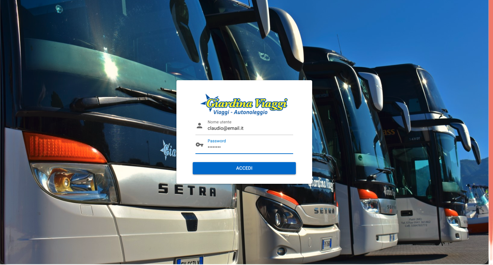
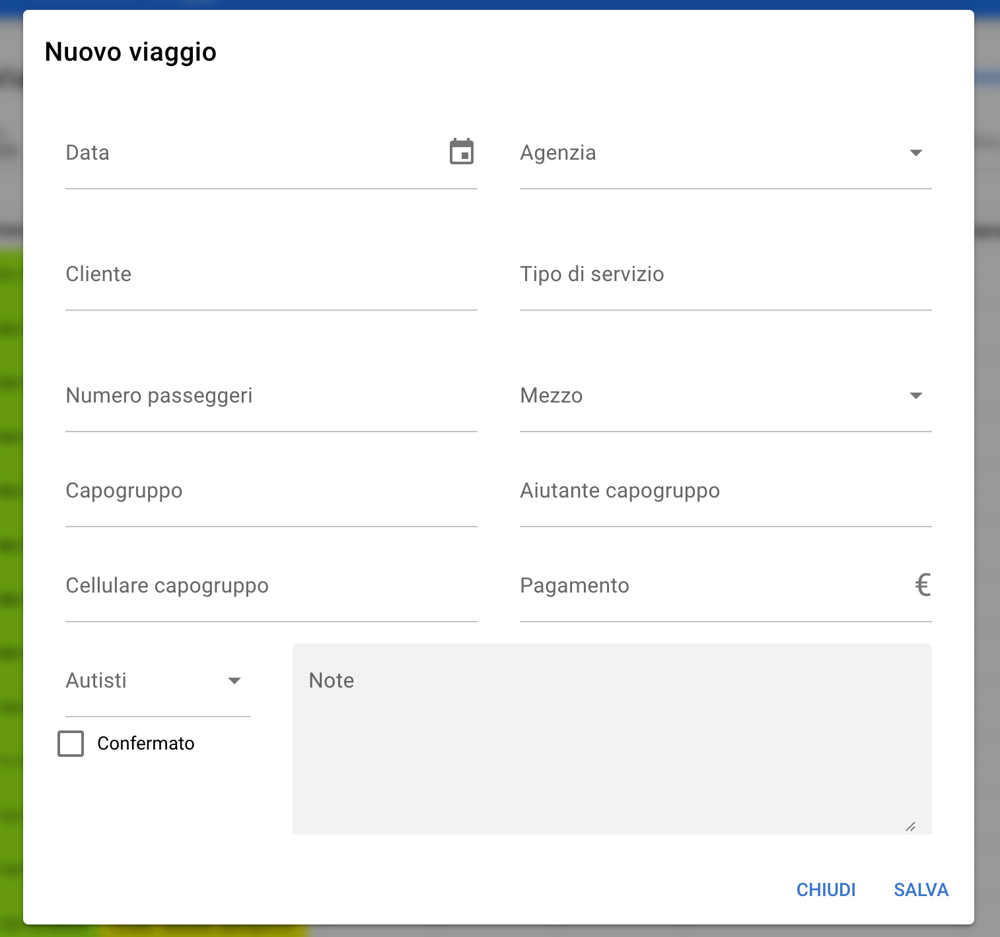
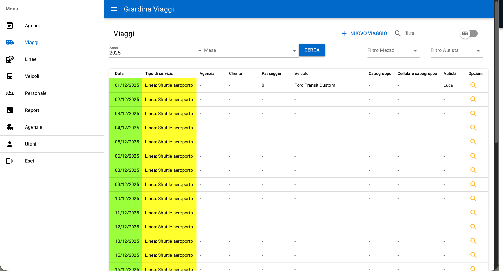
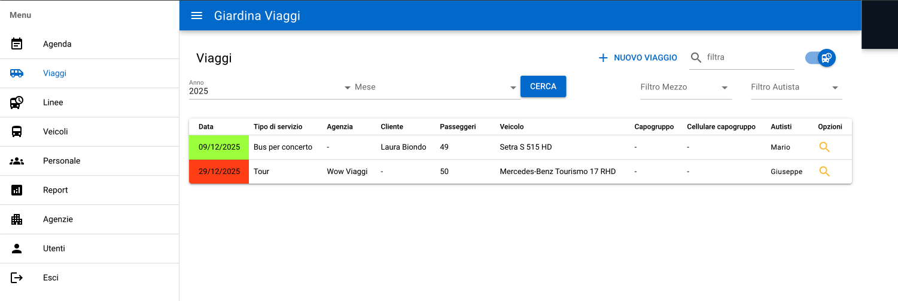
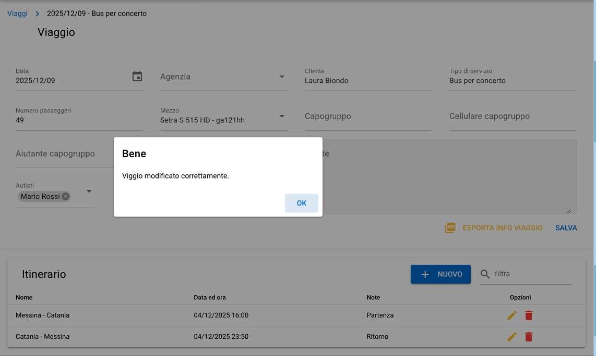
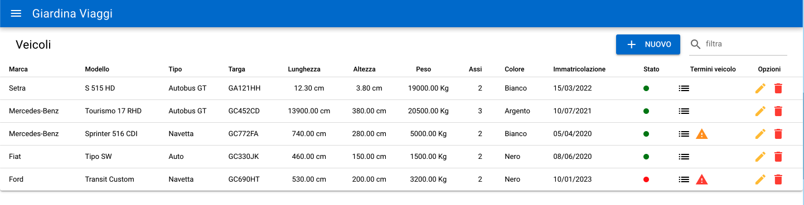
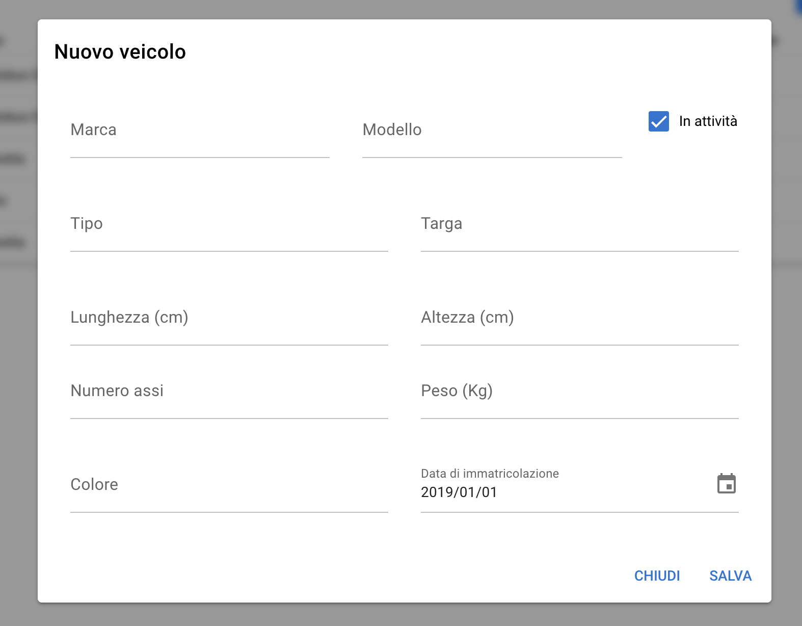
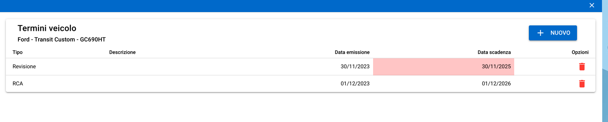
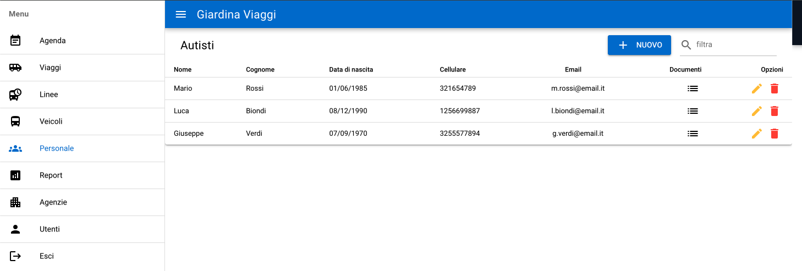

# 🚍 Gestionale Trasporti – Demo
Web App sviluppata in Laravel, Quasar e MySQL, progettata per supportare un'azienda di trasporti nella gestione quotidiana di viaggi, veicoli, autisti, linee e scadenze documentali.

Questa versione demo contiene screenshot e una panoramica funzionale del progetto reale, mantenendo privato il repository originale.

---

## Tecnologie utilizzate
- Laravel,  
- Quasar,
- MySQL,  
- Axios,  
- GitHub.

---

## Obiettivo del progetto
Realizzare un gestionale completo per un’azienda che si occupa di trasporti, navette, servizi turismo e noleggio autobus, con:

- flussi rapidi per la creazione dei viaggi
- pannelli di gestione veicoli con scadenze
- anagrafica autisti
- agenda giornaliera e mensile
- dashboard operativa
- gestione linee e itinerari

Il progetto è stato pensato per essere utilizzato quotidianamente dal personale dell'azienda.

---

## Funzionalità principali

### Gestione Viaggi
- Creazione e modifica dei viaggi,
- Selezione veicoli, autisti, agenzie e clienti,
- Gestione itinerari,
- Filtri per mese, veicolo, autista,
- Esportazione PDF dei dettagli viaggio.

### Gestione Veicoli
- Anagrafica veicoli completa,
- Stato del veicolo,
- Pannello scadenze documentali.

### Personale / Autisti
- Anagrafica autisti con documenti,
- Gestione dati personali e recapiti,
- Associazione veicoli/viaggi.

### Agenda operativa
- Vista giornaliera,
- Vista mensile con generazione automatica delle linee.

### Linee e itinerari
- Creazione di linee ricorrenti,
- Generazione automatica dei viaggi per tutto il mese
- Modifica degli itinerari e orari

---

## Screenshot

### Login

### Dashboard / Agenda

### Creazione viaggio

### Lista viaggi di linea

### Lista viaggi non di linea

### Modifica viaggio

### Lista veicoli

### Creazione veicolo

### Scadenze veicolo

### Lista autisti

---

## Codice sorgente
Il codice completo del progetto è privato.  
Su richiesta, posso fornire accesso temporaneo a un repository privato o una demo guidata.

--- 
